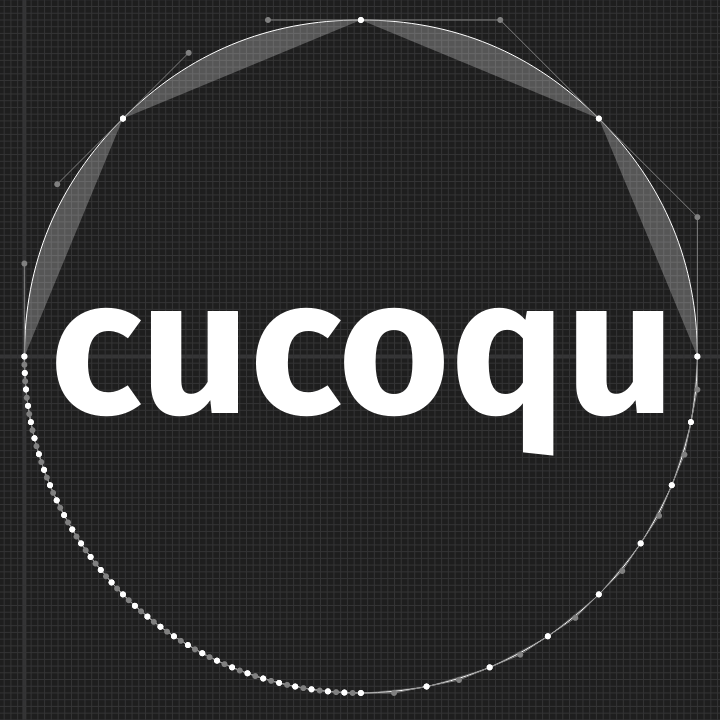

# cucoqu — Cubic ← Conic ← Quadratic



© 2022 Fredrick R. Brennan, MFEK Authors, Skia Authors, and GPT-3<sup>[huh?](GPT-3.md)</sup>

**cucoqu** is a Rust library for converting between different types of Bézier splines. Currently it only supports the types most commonly used in type design and drawing curves: **cu**bic Bézier curves, **qu**adratic Bézier curves, and one type of rational Bézier curve: **co**nic Bézier curves.

This library replaces a lot of calls into Skia's C++ code and conversion back and forth from its point types in MFEK.

## Todo

* arbitrarily raise degree of an n-degree bezier segment 

## API
### Types
#### Cubic
```rust
// Bézier segments
/// A cubic [`Bezier` segment][cubic-bezier].
///
/// [cubic-bezier]: https://en.wikipedia.org/wiki/B%C3%A9zier_curve#Higher-order_B%C3%A9zier_curves
pub type Cubic = [Point; 4];
/// A cubic spline.
pub type CubicSpline = Vec<Cubic>;
```
#### Conic
```rust
/// A conic is defined by two end points `start` and `end` and a control point `control`. It is
/// also defined by a weight `weight` (_w_) which is a non-negative number. The weight has a
/// default value of 1. A conic is also known as an ellipse, circle, parabola, or hyperbola
/// depending on the value of the weight and the relative positions of the control, start, and end
/// points.
///
/// <https://pages.mtu.edu/~shene/COURSES/cs3621/NOTES/spline/NURBS/RB-conics.html>
#[derive(Clone, Default)]
pub struct Conic {
    pub start: Point,
    pub end: Point,
    pub control: Point,
    /// The weight of the conic. If _w_==1, parabolic. If _w_ < 1, elliptical. If _w_ > 1,
    /// hyperbolic.
    pub weight: f32
}
```
#### Quad
```rust
/// A quadratic [`Bezier` segment][quad-bezier].
///
/// [quad-bezier]: https://en.wikipedia.org/wiki/B%C3%A9zier_curve#Quadratic_curves
pub type Quad = [Point; 3];
/// A [quadratic spline][quad-spline].
///
/// [quad-spline]: https://en.wikipedia.org/wiki/B-spline#Quadratic_splines
pub type QuadSpline = Vec<Quad>;
```
### Conversions
#### cu2qu
```rust
/// Convert a cubic Bézier curve to a quadratic spline segment.
pub trait CurveToQuadratic {
    fn curve_to_quadratic(&self, max_err: f32) -> Result<QuadSpline, ApproxNotFoundError>;
}

/// Convert a vector of cubic Bézier curves to a vector of quadratic spline segments.
pub trait CurvesToQuadratic {
    fn curves_to_quadratic(&self, max_errors: Vec<f32>) -> Result<Vec<QuadSpline>, ApproxNotFoundError>;
}

impl CurveToQuadratic for Cubic { … }
impl CurvesToQuadratic for Vec<Cubic> { … }
```
#### co2qu
```rust
/// Convert a “conic” (rational quadratic) Bézier curve to N quadratic spline segments.
impl Conic {
    pub fn as_quads(&self, tol: f32) -> QuadSpline {
        let mut pow2 = self.quad_pow2(tol);
        let orig_pow2 = pow2;
        let ret = self.chop_into_quads_pow2(&mut pow2);
        log::debug!("Tolerance {} yielded QuadSpline of len {}", tol, pow2);
        if orig_pow2 != pow2 {
            log::warn!("Tolerance {} caused lines to be generated, not quads", tol);
        }
        ret
    }
}
```
#### qu2cu
```rust
/// Trait for exact cubic Bézier curve generation from quadratic.
pub trait QuadToCubic<QCO: Default, const N: usize> {
    fn quad_to_cubic(self) -> [QCO; N];
}
```
